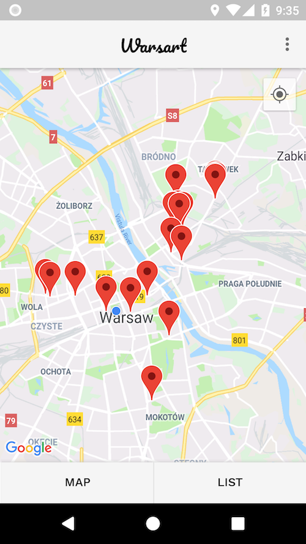
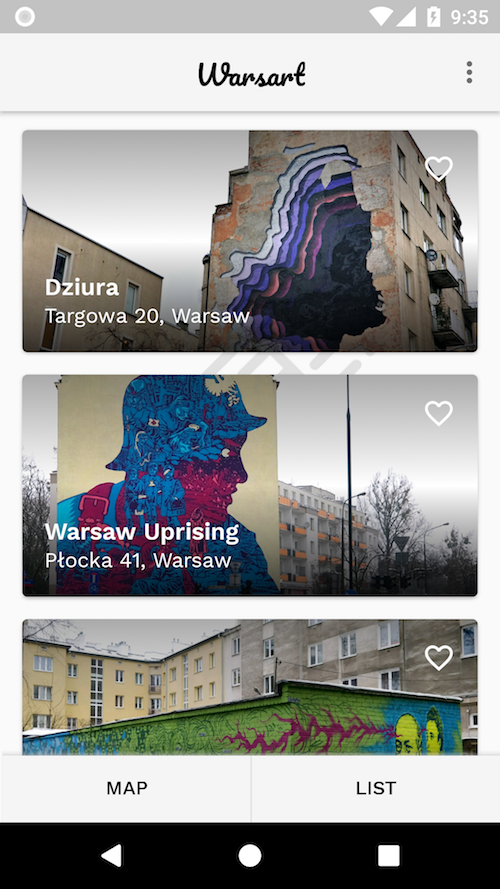
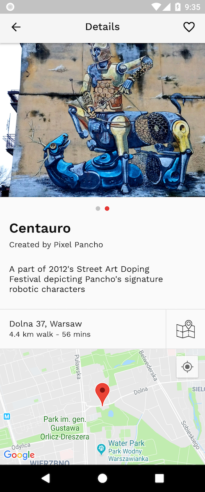

# Warsart (Capstone Project)
A part of the [Android Developer Nanodegree Program](https://eu.udacity.com/course/android-developer-nanodegree-by-google--nd801)

## Usage
To run the app, a [Google API key](https://developers.google.com/maps/documentation/android-sdk/signup) is required. Open `gradle.properties` and insert the API key.

**/gradle.properties**
```
GOOGLE_API_KEY="your-api-key"
```
_The database included in this project contains only a subset of the data I collected whilst in Warsaw._

## Description

Explore street art in Warsaw! The app locates graffiti and murals all over the city. View pictures, read about the pieces, and find out how to get there. Save your favorites and create a list of places to visit. Discover the beautiful city of Warsaw and its rich urban scene at the same time.

### Background

After graduating from KTH in 2017, I decided to live in Warsaw for the rest of the year. Other than trying to learn Polish, I spent a lot of time biking around to discover the art the city has to offer. I had also just begun my journey in Android development and it all resulted in this little passion project I call Warsart.

This project was also my Capstone Project for the Android Developer Nanodegree Program which demonstrated the skills of a proficient Android developer by designing an app and making plans for how to implement it, to show the ability to communicate an app idea formally.

### Screenshots
&nbsp;&nbsp;
&nbsp;&nbsp;


### Features
* Locate street art on a map
* List street art in a list
* Ability to mark an art piece as favorite
* Ability to filter map and list to only show favorites
* Provide a detail view for each individual piece, containing e.g images, description and address
* Home Screen Widget

### Technologies
* [Firebase Realtime Database](https://firebase.google.com/products/realtime-database/)
* [Firebase Storage](https://firebase.google.com/products/storage/)
* [Google Maps API](https://developers.google.com/maps/documentation/android-sdk/intro)
* [Timber](https://github.com/JakeWharton/timber)

### TODO/Further Development
* Use databinding
* Improveme UI/UX
* Make home screen widget more interactive
* User contributions
* Optional notification when device is near street art
* Sort by distance
* Ratings/Comments?
